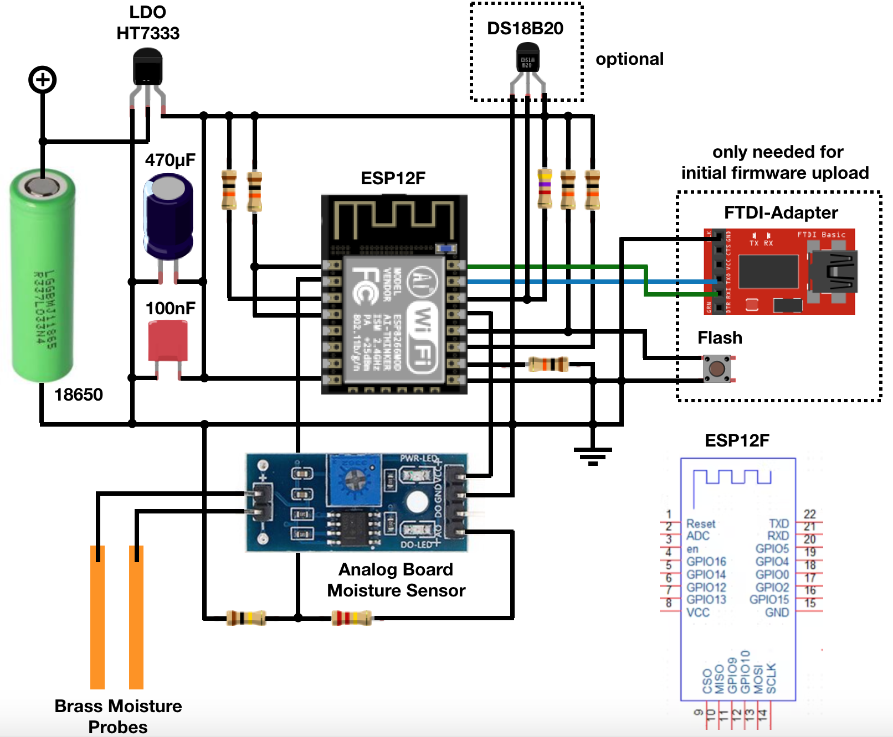

# ESP8266 Moisture Sensor

## Description

Battery powered moisture sensor based on the ESP8266 controller

Read analog value from moisture sensor which consists of two brass rods (and optionally
a DS1820 one-wire temperature sensor) and publish the readings via MQTT. Use deep sleep
inbetween sensor readings to save battery power.

Use MQTT messages to configure the sensor remotely or trigger OTA.

When using a bare ESP12F chip (Generic 8266 Module) with a few external components
compile with reset method 'ck' to initially upload the firmware with a usb-serial-adapter.

## Schematics

## Contributing

Pull requests are welcome! For major changes, please open an issue first to discuss
what you would like to change.

## License

Copyright (c) 2023 Lars Wessels
This software was published under the MIT license.
Please check the [license file](LICENSE).